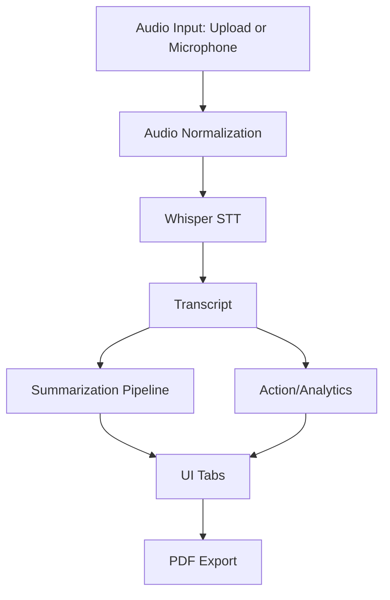

# Interview Notes

Use this as your speaking script when asked to explain system design, implementation, and tradeoffs.

## One-minute System Explanation

"This is a modular meeting intelligence app built with Streamlit. It accepts live-recorded or uploaded audio, converts audio to text using Whisper, summarizes text with a transformer model, extracts action cues and sentiment, and exports the output as a PDF. The architecture separates UI, STT, summarization pipeline, and export modules for maintainability and easier troubleshooting."

## Architecture (High Level)

## Key Design Decisions

1. Lazy-load AI models
- Reduces startup delay and avoids unnecessary heavy loads.

2. Chunk long transcripts before summarization
- Prevents losing context due to token limits.

3. Unified processing path in UI
- Upload/reload/record all call same processing function; behavior is consistent.

4. Fail gracefully
- Empty transcript and model-load errors are surfaced as clear UI messages.

## Implementation Deep Dive (Module-by-Module)

- `app.py`
  - Session state, login/signup, recording/upload controls, and results tabs.
  - Calls a single `_process_audio_file()` function for all processing sources.

- `stt/stt_manager.py`
  - Reads audio via `soundfile`, fallback to `librosa`, converts to mono and target sample rate.

- `stt/whisper_stt.py`
  - Loads Whisper once and reuses cached model for transcription.

- `pipeline/meeting_pipeline.py`
  - `process_meeting()` orchestrates transcript + summary generation.
  - `generate_summary()` handles short text fast path and long-text chunking.

- `export/pdf_export.py`
  - Builds structured PDF with summary and transcript sections.

## Challenges and Tradeoffs

- Challenge: Model download/startup latency.
  - Tradeoff: Better quality model vs faster response.
  - Mitigation: Lazy loading and sensible defaults.

- Challenge: Action item extraction quality.
  - Tradeoff: Heuristic method is fast but less accurate than LLM extraction.
  - Mitigation: Keep current method simple; can upgrade later.

- Challenge: Local auth simplicity vs enterprise-grade security.
  - Tradeoff: JSON + bcrypt is enough for prototype but not production.

## How to Answer "What would you improve next?"

1. Add speaker diarization for who-said-what output.
2. Replace heuristic action extraction with structured LLM extraction.
3. Add pytest + CI pipeline + coverage threshold.
4. Add persistent database and JWT-based auth.
5. Add background job queue for large files.
